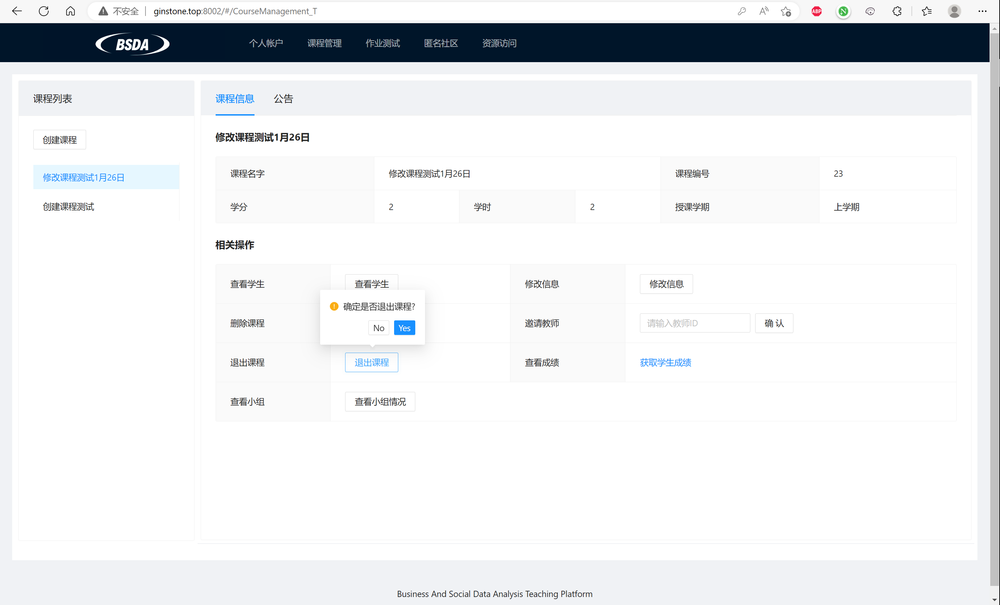

## **RUC Business and Social Data Analysis Teaching Platform**

[Github](https://github.com/gioun/Business-and-Social-Data-Analysis-Teaching-Platform)

> This work is the one that I appreciate the most.
> There should have been a demo link here, but the two servers for front-end and back-end are down now and the domain is expired and I haven't 
deploy it on another server. All I can provie is the [user handbook](../files/BSDAHandbook.pdf) for the course which contains the screenshot of the platform.

||
|---|

The business and social data analysis teaching platform is mainly used to promote the construction of the school's business and social data analysis courses, assist teachers in teaching management, serve students to carry out online experiments, support students to participate in group discussions, anonymous community interaction and questionnaires, data collection, data Business and social data analysis and decision-making activities such as analysis and visualization. The system platform will add new functions that are conducive to the complete realization of teaching functions on the RUC OBE platform. At the same time, it will be connected to online collaboration and code running systems such as Processon, Tencent Documentation, and ACE editor to improve the usability of the platform.

In the work, I conduct system analysis and design with team members and worked for the front-end development of the system with Vue. 

## **Metaverse research platform**

[Video](https://bilibili.com/](https://www.bilibili.com/video/BV1kG411f7S5/?share_source=copy_web&vd_source=a599f114cf6b3eaf2c320393d2c76f46)

  | 
---|---

Metaverse research platform is a demo of metaverse which contains a map, avatars, multiplayer text chat system, developed with Unreal Engine 4.27.

In the work, I was responsible for the system analysis and design, and I lead the development of the project.

## **Technology maturity curve visualization platform**

[Github](https://github.com/gioun/Technology-maturity-curve-visualization-platform)

Technology maturity curve visualization platform is a web which was developed to show the maturity change of the technology based on the data from Gartner Hype Cycle. It was developed with Vue, and the curve chart was adapted from echart.

In the work, I conduct system analysis and design with team members and worked for the front-end development of the system with Vue. 
