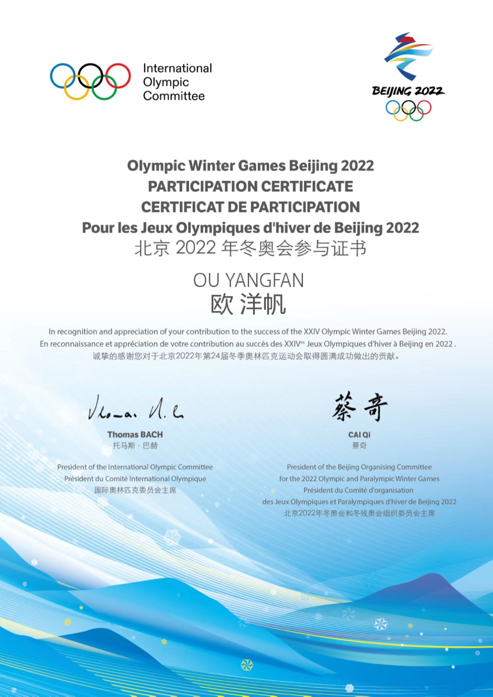

## **Olympic Winter Games Beijing 2022 volunteer**
||
|---|

- I was a volunteer for the access control at the Beijing Winter Olympics, where I was responsible for checking the qualifications of the personnel entering the venues and controlling the access of the personnel to the venues.
- My major responsibilities included verifying the identity and credentials of the personnel, scanning and validating the passes, and ensuring the compliance with the health and safety protocols.
- I also engaged with other volunteers and staff members to coordinate the access control operations, provide customer service and assistance, and report any issues or feedback to the supervisors.

## **Returning Home social practice**

- I participated in the social practice activity organized by the Communist Youth League of Babu District, Hezhou.
- My activity experience included interning at the Forestry Bureau, where I was responsible for handling the assigned tasks in the office, and visiting the forest farm, where I participated in the research work.
- I learned a lot from this activity, such as the basic knowledge and skills of forestry, the current situation and challenges of forestry development, and the importance of environmental protection and ecological conservation.
